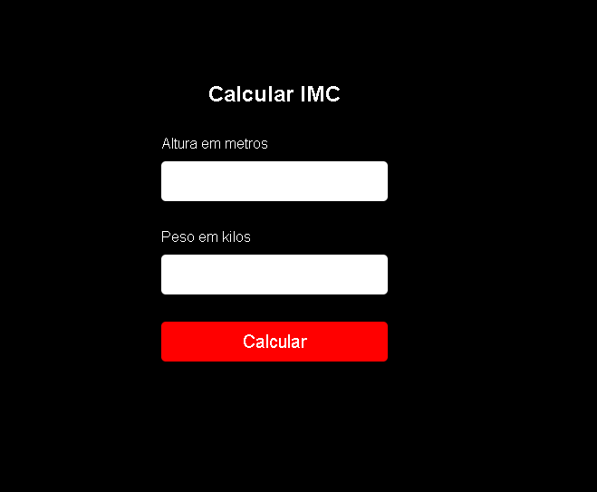

<h1>imc-simples</h1>

<h2>Sobre o projeto</h2>

Uma calculadora simples de IMC, onde se coloca o peso e a altura, e ela retorna o calculo do IMC, feito com js, html e css.

<h2>Como executar</h2>
Utilizar a extenção do live-server no arquivo index.html

